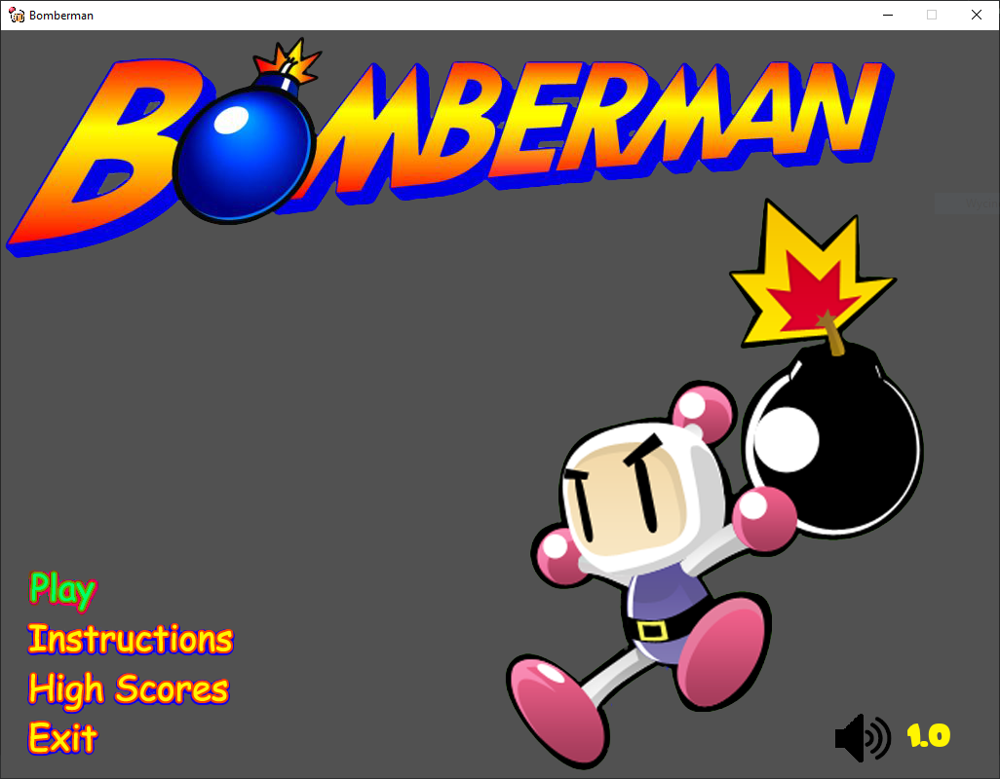
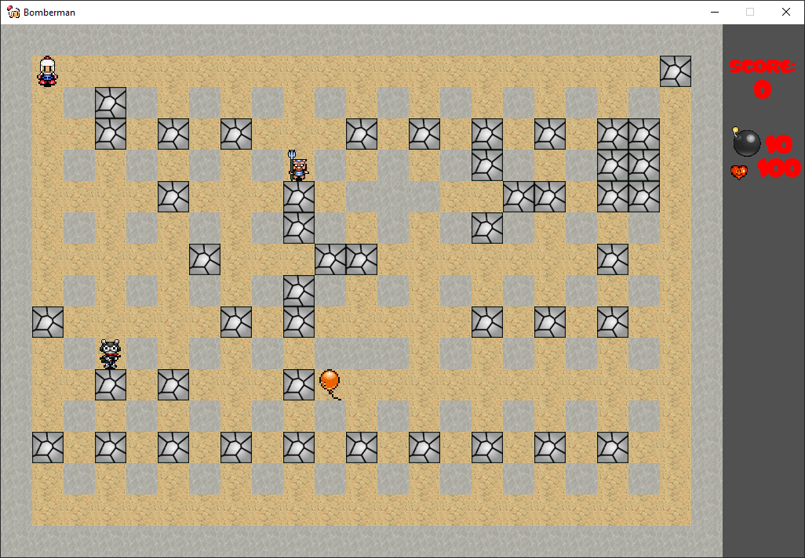
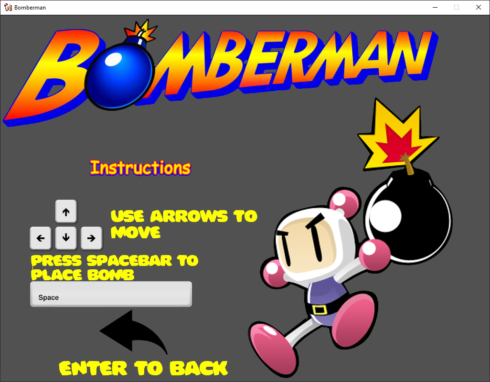
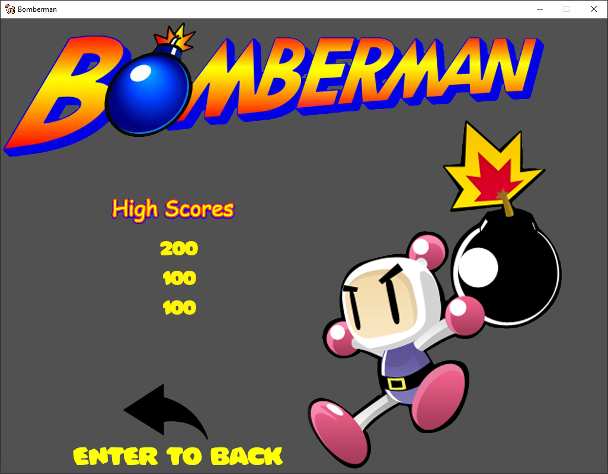

# Bomberman
## Table of contents
* [General info](#general-info)
* [Technologies](#technologies)
* [Setup](#setup)
* [Authors](#authors)
* [Screenshots](#screenshots)

## General info
**Bomberman game (pegasus version) created using Python and Pygame as the final project of Python classes at the university.**

## Technologies
Project is created with:
* Python version 3.8.2
* Pygame version: 1.9.6

## Setup
To open and run this project, follow this commands:
1. git clone https://github.com/wlazlok/Bomberman.git
2. cd Bomberman
3. python main.py

## Authors
* **[Karol Wlazło](https://github.com/wlazlok)**
* **email:** kwlazo9@gmail.com
* **[Marcin Drelewski](https://github.com/Miatosz)**
## Screenshots

